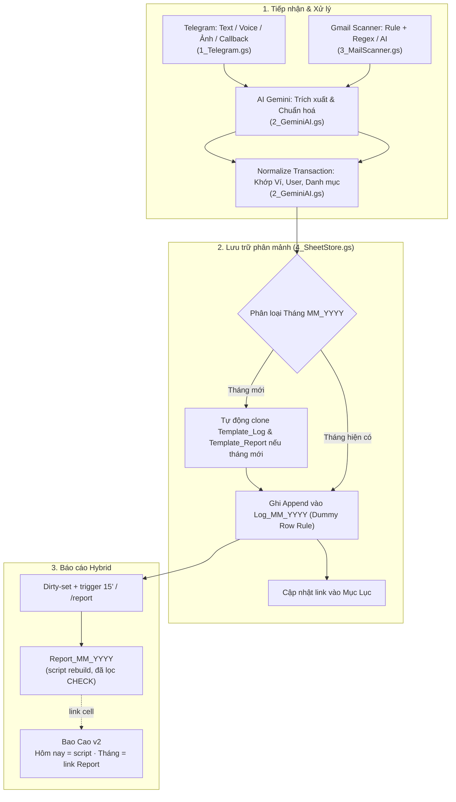

# Cấu trúc Kiến trúc Dự án — Sổ Thu Chi AI v2 (Hệ Thống Mới)

> **Mục tiêu**: Tối giản, vận hành mượt mà, phân tán dữ liệu theo tháng (`Log_MM_YYYY`), báo cáo **hybrid** (Report tháng do script nấu có lọc CHECK; Bao Cao link Report), kiến trúc code dạng **Modular hóa** dễ bảo trì.

---

## 1. Bản đồ Kiến trúc Mã nguồn (Modular Structure)

Dự án được phân tách thành các module chuyên biệt:
```
├── 0_Config.gs         # Hằng số, GID, Tọa độ 9 cột, Cấu hình ScriptProperties, Quản lý Token & Menu GAS
├── 1_Telegram.gs       # Webhook Telegram (doPost), xử lý Text/Voice/Photo/Callback, Quick Edit, Undo 24h
├── 2_GeminiAI.gs       # Gọi Gemini API, trích xuất JSON, chuẩn hóa giao dịch (Alias, Sổ tay, AI Learning)
├── 3_MailScanner.gs    # Quét Gmail ngân hàng tự động theo Rule/Regex & AI Fallback
├── 4_SheetStore.gs     # Quản lý Sheet Shard tháng (Log_MM_YYYY, Report_MM_YYYY), Mục Lục, Dummy Row, CRUD data
├── 5_ReportRebuild.gs  # Hybrid báo cáo: dirty-set, rebuild Report tháng, timestamp, trigger dirty, /report
├── 9_Tools.gs          # Tiện ích tạm: Đồng bộ giao diện, theme, format, viền cho Log & Report tháng từ Template
├── configui.html       # Web App HTML giao diện cấu hình (Model AI, API Keys, Chủ TK, Prompt, Quét Mail)
├── archive/Code.legacy.txt  # [THAM KHẢO] Monolith cũ — KHÔNG deploy (không dùng đuôi .gs)
└── Structure.md        # Tài liệu kiến trúc chuẩn của dự án
```

### Chi tiết nhiệm vụ từng Module:
- **`0_Config.gs`**:
  - Quản lý định danh `GID` cố định của các Sheet hệ thống.
  - Tọa độ chuẩn 9 cột `MONTH_LOG_COL`.
  - Cấu hình Web App qua `doGet`, khởi tạo Token bảo mật, menu tùy chỉnh trên Google Sheets (`Sổ Thu Chi AI`).
- **`1_Telegram.gs`**:
  - Điểm tiếp nhận Webhook `doPost` (Lock Cache chống trùng).
  - Bảo mật bắt buộc: `webhook_secret` + `admin_id` (text & callback).
  - Voice / Photo / Text / Callback; Preview → Confirm → sửa theo field (EDITSESS_ + pick list) → Undo 24h.
  - Lệnh: `/start`, `/help`, `/report` (+ nút Tháng / 3 tháng), `/scan`. Gỡ nút ✏️/↩️ sau 24h.
- **`2_GeminiAI.gs`**:
  - Xoay vòng API Keys (`getShuffledKeys`).
  - `callGeminiAPI` / `transcribeVoiceGemini`.
  - `normalizeTransaction`: `matchDict` sổ tay + CHECK `thu_chi` / `vi` / `doi_tuong` / `danh_muc`.
  - `getLiveData`: DV Template_Log + Alias + AI_Learning.
- **`3_MailScanner.gs`**:
  - `scanMail`: Tự động tìm kiếm email ngân hàng theo khoảng ngày hoặc số ngày thiết lập.
  - Bóc tách theo Rule từ tab `Quet Mail` và số tiền qua Regex; fallback sang Gemini AI nếu phức tạp.
- **`4_SheetStore.gs`**:
  - `getOrCreateMonthSheets`: Tự động clone `Template_Log` & `Template_Report` khi sang tháng mới.
  - `appendRowsToMonthLog`: Áp dụng quy tắc **Dummy Row** bảo toàn 100% format & validation dropdown.
  - `ensureMonthInMucLuc_`: Tự động cập nhật hyperlink tại tab `Mục Lục`.
  - Quản lý đồng bộ `AI_Learning`, sửa/xóa giao dịch theo `Unique Key`.
- **`5_ReportRebuild.gs`**:
  - Hybrid: `rebuildReportMonth` nấu số tĩnh Report tháng (lọc CHECK + Chưa phân loại).
  - Dirty-set + trigger 15’ chỉ tháng dirty; timestamp Report!D1 / Bao Cao!F1.
  - `/report` và sau ghi Log: rebuild-before-read / nấu tháng đụng.
  - `ensureMonthLinkedOnBaoCao_`: gắn dòng link tháng mới trên Bao Cao v2.
- **`9_Tools.gs`**:
  - Tiện ích đồng bộ giao diện chạy tay từ menu / GAS Editor (không chạy tự động trong webhook).
  - `syncAllMonthLogTheme` / `syncOneMonthLogTheme`: Đồng bộ format Log tháng từ `Template_Log`.
  - `syncReportBoldBlock` / `syncOneMonthReportTheme` / `autoBorderReportTables_`: KPI + viền Report tháng.
  - **Làm mới format/data Log**: `format` | `data` | `both` × tháng đang mở | tất cả tháng.
  - `showTemplateLog` / `hideTemplateLog`: Hiện/ẩn `Template_Log` để chỉnh sửa thủ công.
- **`archive/Code.legacy.txt`** *(Thư viện tham khảo)*:
  - Monolith cũ — chỉ tra cứu flow lịch sử.
  - **Không deploy** (không đặt đuôi `.gs` trong project GAS đang chạy).

---

## 2. Sơ đồ Luồng tổng quan (End-to-End Flow)



---

## 3. Bản đồ & Vai trò của các Sheet trong Spreadsheet

| Nhóm | Tên Sheet | GID / Quy ước | Vai trò & Cơ chế vận hành |
| :--- | :--- | :--- | :--- |
| **Điều hướng** | `Mục Lục` | Tự động | Liệt kê tất cả các tháng, link điều hướng nhanh tới `Log_MM_YYYY` và `Report_MM_YYYY`. |
| **Dữ liệu tháng** | `Log_MM_YYYY` | Nhân bản từ Template | **Nguồn dữ liệu gốc duy nhất** (9 cột). Script chỉ append dòng mới vào đây. |
| **Báo cáo tháng** | `Report_MM_YYYY` | Nhân bản từ Template | Sổ cái đã ghi nhận: script `rebuildReportMonth` ghi số tĩnh (lọc CHECK / Chưa phân loại). D1 = timestamp hoặc badge dirty. |
| **Báo cáo tổng** | `Bao Cao v2` | `1475474497` | • **Hôm nay**: script ghi A2:E2 (cùng rule lọc).<br>• **Bảng tháng**: link `Report!B3:B6`.<br>• F1 = `Cập nhật đến…`. |
| **Báo cáo trọn đời** | `Tóm tắt_v2` | `129580313` | Báo cáo tổng thể toàn thời gian (Lifetime) cho Ví, Đối tượng, Danh mục qua công thức `VSTACK` / `QUERY` / `SUMIFS`. |
| **Bản mẫu** | `Template_Log`<br>`Template_Report` | `192263148`<br>`56513848` | Sheet khuôn mẫu chứa sẵn định dạng chuẩn và công thức tự động để script clone khi có tháng mới. |
| **Bổ trợ (Bảo vệ)** | `Quet Mail` | `2033507127` | Quy tắc lọc tiêu đề mail ngân hàng & regex bóc tách. |
| | `Alias` | `1498755942` | Từ khóa nhận diện nhanh Ví, Danh mục, Đối tượng. |
| | `AI_Learning` | `203251644` | Lưu vết chỉnh sửa thủ công của người dùng để dạy AI. |
| | `Log_Chuyen` | Tự động | Lịch sử truy vết các giao dịch được chuyển giữa các tháng. |

> **Nguyên tắc bảo vệ Sheet cũ**: Giữ nguyên vẹn tuyệt đối các sheet cũ (`Giao dịch_v2`, `Bao cao_v2`, `Tóm tắt_v2`, `Alias`, `AI_Learning`, `Quet Mail`).

---

## 4. Cấu trúc Dữ liệu chuẩn (9 Cột) & Quy tắc Dummy Row

### 4.1 Cấu trúc 9 Cột duy nhất (Log_MM_YYYY & Template_Log)
```
Cột A: Ngày (dd/MM/yyyy)
Cột B: Phân loại (Thu / Chi)
Cột C: Số tiền (Số âm cho Chi, Số dương cho Thu)
Cột D: Nguồn tiền / Ví (Cash, Bank, Credit, ...)
Cột E: Đối tượng (Bản thân, Couple, Khách hàng, ...)
Cột F: Danh mục con (Ăn sáng, Cafe, Xăng xe, ADS, ...)
Cột G: Ghi chú
Cột H: Unique Key / Tracking ID (TX_* / MAIL_*)
Cột I: Trạng thái (`CHECK:reason,…` / rỗng khi OK)
```
*(Bỏ hoàn toàn cột Danh mục cha vật lý trên sheet Log để tối giản dữ liệu; danh mục cha được tra cứu tự động qua bảng Master).*

### 4.2 Quy tắc Dummy Row (Chèn dòng bảo toàn format)
1. Xác định vị trí Dummy Row cuối bảng (`dummyRow = lastDataRow + 1`).
2. Chèn N dòng mới lên trên Dummy Row: `sheet.insertRowsBefore(dummyRow, N)`.
3. Copy toàn bộ Format và Data Validation từ dòng Dummy xuống N dòng vừa tạo.
4. Ghi giá trị vào vùng vừa chèn.

---

## 5. Cơ chế Báo cáo Hybrid (Report script + dashboard link)

### 5.1 Báo cáo tháng (`Report_MM_YYYY`)
* Script đọc `Log_MM_YYYY`, **loại** dòng `CHECK*` hoặc còn `Chưa phân loại`.
* Ghi tĩnh: Thu / Chi / Ròng / Số cần xác nhận / Số GD + block Ví / Đối tượng / Danh mục.
* `D1`: `Cập nhật đến …` hoặc `⚠ Có thay đổi chưa vào báo cáo`.

### 5.2 Báo cáo tổng (`Bao Cao v2`)
* **Hôm nay (A2:E2)**: script `refreshBaoCaoToday_` (cùng rule lọc).
* **Bảng tháng**: `='Report_MM_YYYY'!B3` … `B6` (tự nhảy khi Report được nấu).
* `F1`: timestamp lần nấu thành công gần nhất.

### 5.3 Khi nào nấu Report
* Sau ghi / sửa / xóa / undo / scanMail (tháng đụng).
* `/report` (ép tháng hiện tại rồi gửi Telegram + timestamp; nút Tháng này / 3 tháng đọc Bao Cao A3:A5).
* Menu **Làm mới báo cáo**; trigger 15’ chỉ tháng dirty.
* `onEdit` Log chỉ đánh dirty (không nấu trong simple trigger).

---

## 6. So sánh Hệ thống Cũ vs Hệ thống Mới

| Tiêu chí | Hệ thống cũ | Hệ thống mới (v2) |
| :--- | :--- | :--- |
| **Kiến trúc Code** | 1 file `Code.gs` cồng kềnh (>4900 dòng) | **Modular hóa (7 file .gs + 1 html)** |
| **Ghi dữ liệu** | Ghi 2 nơi (Giao dịch_v2 + Log tháng) | **Chỉ ghi 1 nơi duy nhất (`Log_MM_YYYY`)** |
| **Tính toán Báo cáo** | Code rebuild tĩnh + trigger 15’ | **Hybrid**: Report = script (lọc CHECK); Bao Cao tháng = link; dirty + `/report` |
| **Tốc độ phản hồi** | Chậm (3 - 6 giây do rebuild) | **Ghi sổ nhanh**; báo cáo nấu hẹp theo tháng đụng |
| **Bảo trì & Tùy biến** | Phải sửa Apps Script khi đổi giao diện | **Tùy biến trực tiếp trên Template Sheet** |
| **Độ ổn định** | Dễ lỗi cell, xung đột lock | **Phân mảnh theo tháng, bảo toàn format qua Dummy Row** |
