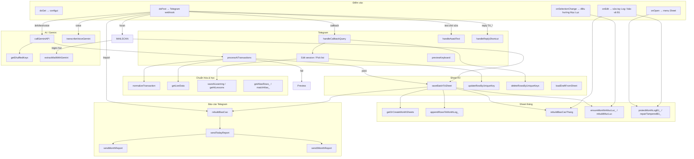

# Cấu trúc `Code.gs` — Sổ Thu Chi AI v2

> Mục đích: bản đồ nhanh để tìm hàm, hiểu luồng, và biết chỗ nào nên tối ưu.  
> File nguồn: `Code.gs` (~3535 dòng). Cập nhật khi thêm/bớt hàm lớn, đặc biệt khi thay đổi kiến trúc `Log` tổng và `Log` theo tháng.

---

## 1. Sơ đồ tổng quan



---

## 2. Mô hình dữ liệu: 2 lớp chạy song song

`Code.gs` hiện vận hành theo **kiến trúc song song**:

### 2.1 Master Log

- Nguồn dữ liệu tổng hợp vô hạn qua Named Range `Log`.
- 10 cột theo `LOG_COL`.
- Có cột `DANH_MUC_CHA` ở index 5 nhưng script **không ghi trực tiếp**.
- Dùng nhiều cho:
  - `scanMail` blacklist unique keys
  - `rebuildBaoCao` tổng hợp hôm nay + 3 tháng gần nhất
  - `getLiveData` lấy history
  - `readLogRowByUniqueKey` / edit flow Telegram
  - `updateRowByUniqueKey` / `deleteRowsByUniqueKeys`

### 2.2 Monthly Shard Log

- Mỗi tháng có một sheet `Log_MM_YYYY`.
- 9 cột theo `MONTH_LOG_COL`.
- Không có cột `DANH_MUC_CHA`; báo cáo tháng tự suy ra danh mục cha từ map `Category`.
- Tự tạo từ `Template_Log` bằng `getOrCreateMonthSheets()`.
- Mỗi sheet có `B1` là mã tháng chuẩn `MM/YYYY`, được bảo vệ và tự hoàn nguyên nếu sửa sai.
- Dùng cho:
  - `rebuildBaoCaoThang(monthKey)`
  - `Mục Lục`
  - kiểm tra lệch tháng khi edit tay hoặc update giao dịch

### 2.3 Hệ quả thiết kế

- Khi ghi mới, script **ghi cả hai nơi**.
- Khi sửa/xóa theo `uniqueKey`, script cũng cập nhật cả hai mô hình.
- `Bao Cao v2` vẫn đọc từ `Log` tổng.
- `Report_MM_YYYY` đọc từ `Log_MM_YYYY` tương ứng.

---

## 3. Bản đồ phần theo dòng

| Phần | Dòng (ước lượng) | Vai trò |
|------|------------------|---------|
| **1. Thiết lập & tọa độ** | `1–324` | Hằng số, token config, menu, webhook, batch report |
| **2. Sheet trigger** | `325–452` | `onEdit`: giữ dấu ±, bảo vệ `B1`, rebuild báo cáo tháng liên quan |
| **3. Telegram core** | `453–1303` | Webhook, preview, confirm, undo, edit flow |
| **4. Chuẩn hóa giao dịch** | `1304–1723` | Normalize, diff, format, parse quick edit, cache |
| **5. Gemini** | `1724–1868` | Xoay API keys, gọi Gemini, parse JSON |
| **6. Quét mail** | `1869–2041` | Gmail rules + regex + fallback AI |
| **7. Ghi sheet & đồng bộ** | `2042–2410` | Ghi Log tổng, Log tháng, sửa/xóa, khôi phục draft |
| **8. Hệ tháng & Mục Lục** | `2411–2867` | Tạo sheet tháng, bảo vệ B1, Mục Lục, điều hướng |
| **9. AI learning + live data** | `2868–3142` | Lưu bài học, alias, dictionary, history |
| **10. Utils + báo cáo** | `3143–3535` | Voice, format, report tổng, report tháng |

---

## 4. Index hàm theo nhóm

### 4.1 Phần 1 — Config & bootstrap

| Hàm | Việc làm |
|-----|----------|
| `getConfigToken` / `getConfigUrl` | Tạo token bảo mật cho trang cấu hình |
| `doGet` | Serve `configui.html` qua `?config=<token>` |
| `maskApiKey` | Che key trước khi trả UI |
| `getConfigToUI` / `saveConfigFromUI` | Đọc/ghi Script Properties |
| `getSoNgayQuetFromProps` / `getSoNgayQuet` / `buildGmailDateFilter` | Xử lý số ngày hoặc khoảng ngày quét Gmail |
| `normalizeDateInput` / `parseOwnerNamesInput` | Parse input form |
| `showConfigDialog` | Mở dialog cấu hình trong Spreadsheet |
| `setWebhook` | Gắn webhook Telegram về URL Web App |
| `onOpen` | Tạo menu, tự guard B1, repair B1 bị sửa tay |
| `guardAllMonthLogB1UI` | Chạy tay từ menu để khóa toàn bộ B1 của Log tháng |
| `rebuildTatCaBaoCao` | Rebuild `Bao Cao v2` và report tháng hiện tại |

**Hằng số quan trọng**

- `LOG_COL` — cột của Master Log (10 cột)
- `MONTH_LOG_COL` — cột của Log tháng (9 cột)
- `AI_LEARNING_SHEET`
- `BAO_CAO_SHEET = 'Bao Cao v2'`
- `MUC_LUC_SHEET_NAME = 'Mục Lục'`
- `TEMPLATE_LOG_GID`, `TEMPLATE_BAOCAO_GID`, `ALIAS_SHEET_GID`
- `DRAFT_TTL`, `UNDO_TTL`, `EDIT_SESS_TTL`, `OPTS_PAGE_SIZE`, `AI_MAIL_MAX_CALLS`

---

### 4.2 Phần 2 — Sheet trigger

| Hàm | Việc làm |
|-----|----------|
| `onEdit` | Giữ dấu ± theo Thu/Chi cho cả Master Log và Log tháng; bảo vệ `B1`; track tháng bị ảnh hưởng để rebuild report tháng |

**Điểm đáng chú ý**

- Nếu sửa `B1` trên `Log_MM_YYYY`, script tự hoàn nguyên tháng chuẩn.
- Nếu sửa cột `Ngày`, script có thể rebuild cả tháng cũ lẫn tháng mới.
- `onEdit` nhận diện đúng mô hình qua Named Range `Log` hoặc regex tên sheet `Log_\d{2}_\d{4}`.

---

### 4.3 Phần 3 — Telegram core

**Entrypoint & pipeline**

| Hàm | Việc làm |
|-----|----------|
| `doPost` | Webhook: lock `update_id` → callback / voice / await / lệnh / reply shortcut / AI |
| `processAiTransactions` | Normalize từng giao dịch; pass → `commitDraft`; fail → preview + draft |
| `handleCallbackQuery` | Router nút confirm / undo / edit / save / page / custom |
| `handleReplyShortcut` | Reply vào tin `TX_*`: `ví MB`, `380k`, `dm ...`, `hủy` |
| `transcribeVoiceGemini` | Chuyển voice thành text |
| `scheduleClearCommittedKeyboard` / `ensureClearKeyboardTrigger` / `runClearCommittedKeyboardInterval` / `runClearCommittedKeyboard` | Gỡ nút sau 24h |

**Draft & commit**

| Hàm | Việc làm |
|-----|----------|
| `previewKeyboard` / `committedKeyboard` | Nút inline cho preview / đã ghi |
| `commitDraft` | Ghi giao dịch vào sheet + tạo cache undo |
| `undoCommitted` | Xóa giao dịch theo unique keys |

**Edit flow**

| Hàm | Việc làm |
|-----|----------|
| `startEditFlow` / `showEditMenu` | Mở menu sửa |
| `beginFieldEdit` / `showPickList` / `beginCustomInput` | Chọn field, phân trang gợi ý, nhập tay |
| `applyPickValue` / `handleAwaitText` | Áp giá trị từ nút hoặc text chờ nhập |
| `resolveCustomDictValue` / `handleCustomChoice` | Xử lý custom value và hỏi có thêm vào sổ tay không |
| `confirmEditSessionSave` | So diff, kiểm tra fingerprint, update sheet, lưu AI learning |
| `editSessKey` / `deepCopyTx` / `openEditSession` / `getEditSession` / `applyToEditSession` | Quản lý session sửa |
| `getSheetFingerprint` / `readLogRowByUniqueKey` | Đọc lại dữ liệu dòng đã ghi theo `uniqueKey` |
| `addToNotebook` | Thêm mục mới vào các sheet từ điển |

---

### 4.4 Phần 4 — Chuẩn hóa giao dịch & helpers

| Hàm | Việc làm |
|-----|----------|
| `normalizeTransaction` | Chuẩn hóa ngày, Thu/Chi, số tiền, map ví/đối tượng/danh mục, gắn `status` |
| `matchDict` / `parseMoneyToken` | Khớp sổ tay / parse tiền |
| `snapshotTx` / `diffSnapshots` | So sánh trước-sau khi sửa |
| `formatOneTx` / `buildTxMessage` | Format tin Telegram |
| `parseQuickEdit` | Parse lệnh sửa nhanh |
| `extractTxIdFromText` / `escapeHtml` | Lấy `TX_*`, escape HTML |
| `suggestTopOptions` | Gợi ý theo bài học AI |
| `fieldMapName` | Đổi key field thành nhãn |
| `putJsonCache` / `getJsonCache` | Cache JSON |
| `answerCallback` / `clearInlineKeyboard` | Telegram UX |

**Rule tự ghi**: nếu `normalizeTransaction.pass = true`, `processAiTransactions` sẽ gọi `commitDraft` ngay, giữ nút Sửa/Hoàn tác trong 24h.

---

### 4.5 Phần 5 — Gemini

| Hàm | Việc làm |
|-----|----------|
| `getShuffledKeys` | Xáo / xoay danh sách `ai_keys` |
| `callGeminiAPI` | Gọi Gemini với prompt + liveData + ảnh; retry theo từng key; parse JSON `giao_dich` |

---

### 4.6 Phần 6 — Quét mail

| Hàm | Việc làm |
|-----|----------|
| `triggerScanMailUI` | Chạy scan từ menu Sheet |
| `scanMail` | Rule `Quet Mail` + Gmail → regex; thiếu dữ kiện → AI fallback |
| `extractMailWithGemini` | Tách tiền / ref / phương thức thanh toán từ mail |

**Lưu ý**

- `scanMail` vẫn lấy blacklist unique keys từ Master Log (`Log`).
- Dữ liệu quét xong đi qua `saveBatchToSheet`, nên vẫn được fan-out sang sheet tháng.

---

### 4.7 Phần 7 — Ghi sheet & đồng bộ hai mô hình

| Hàm | Việc làm |
|-----|----------|
| `saveBatchToSheet` | Ghi batch vào Master Log, phân nhóm theo tháng, append vào `Log_MM_YYYY`, rebuild báo cáo |
| `updateRowByUniqueKey` | Sửa 1 giao dịch theo `uniqueKey` trên cả Log tổng và Log tháng |
| `deleteRowsByUniqueKeys` | Xóa giao dịch trên cả hai mô hình |
| `readMonthOfUniqueKey_` | Xác định tháng của một `uniqueKey` |
| `deleteRowsFromRange_` | Xóa nhiều dòng an toàn |
| `loadDraftFromSheet` | Khôi phục draft nếu mất cache |

**Điểm đáng chú ý**

- `saveBatchToSheet` vẫn coi Named Range `Log` là điểm ghi gốc trước.
- Sau đó giao dịch được tách theo `monthKey` để append vào từng sheet tháng.
- Mỗi tháng chạm tới đều được `rebuildBaoCaoThang(monthKey)` + `ensureMonthInMucLuc_(monthKey)`.
- Cuối cùng mới `rebuildBaoCao()` cho `Bao Cao v2`.

---

### 4.8 Phần 8 — Hệ tháng, bảo vệ B1, Mục Lục

| Hàm | Việc làm |
|-----|----------|
| `ensureAiLearningSheet` | Đảm bảo sheet `AI_Learning` tồn tại |
| `getSheetByGid_` | Lấy sheet theo GID |
| `normalizeSheetName_` / `parseMonthDate_` | Chuẩn hóa tên / parse tháng |
| `getMonthKeyFromDate_` / `getCurrentMonthKey_` / `getMonthKeyFromAnyDate_` | Tạo khóa tháng `MM_YYYY` |
| `isMonthLogSheetName_` / `getMonthKeyFromSheetName_` | Nhận diện sheet `Log_MM_YYYY` |
| `monthSheetName_` / `monthReportSheetName_` | Sinh tên sheet tháng |
| `getMonthLogTitleCell_` / `getMonthLogMonthCell_` | Vị trí metadata sheet tháng |
| `getSheetMonthKeyFromB1_` / `normalizeMonthKey_` / `getTransactionMonthKey_` / `checkMonthMatch_` | So khớp tháng dữ liệu với tháng chuẩn của sheet |
| `getMonthLogDataStartRow_` / `getMonthLogRangeInfo_` | Tìm vùng data thực tế trong Log tháng |
| `getOrCreateMonthSheets` | Tạo/cấp phát `Log_MM_YYYY` + `Report_MM_YYYY` từ template |
| `guardAllMonthLogB1_` / `protectMonthLogB1_` / `repairTamperedB1_` | Khóa B1 và sửa lại nếu bị đổi tay |
| `getOrCreateMucLucSheet_` | Tạo/cấp phát sheet `Mục Lục` |
| `countMonthLogRows_` / `buildMucLucRow_` / `findMucLucRow_` | Dữ liệu phụ cho Mục Lục |
| `ensureMonthInMucLuc_` | Upsert một tháng vào `Mục Lục` |
| `initMonth` / `initMonthHienTai` | Tạo sẵn sheet cho tháng chỉ định / tháng hiện tại |
| `rebuildMucLuc` | Quét toàn bộ `Log_MM_YYYY` để dựng lại `Mục Lục` từ đầu |
| `onSelectionChange` | Click ô tháng trong `Mục Lục` để nhảy tới `Log_MM_YYYY` |
| `makeMonthLogRow_` / `appendRowsToMonthLog_` | Tạo row 9 cột và append vào Log tháng |

---

### 4.9 Phần 9 — AI learning, alias, live data

| Hàm | Việc làm |
|-----|----------|
| `saveAiLearning` / `getAiLessons` | Ghi và đọc bài học từ các lần sửa |
| `getAliasRows_` / `matchAlias_` | Đọc sheet `Alias`, match từ khóa |
| `getLiveData` | Gom wallets, users, categories, history, lessons, aliases phục vụ AI |
| `getParsedAiKeys_` | Parse mảng API keys từ Properties |
| `callTelegramApi_` | Wrapper Telegram API |
| `findRowIndexByUniqueKey_` | Tìm nhanh dòng theo `uniqueKey` |
| `returnMsg` / `sendMessage` / `deleteMessage` / `editMessage` | I/O Telegram |
| `formatMoney` / `guessMimeFromPath` / `getTelegramFileBase64` / `getTelegramImageBase64` | Utils tiền, file, ảnh |

---

### 4.10 Phần 10 — Voice + báo cáo

| Hàm | Việc làm |
|-----|----------|
| `transcribeVoiceGemini` | Voice → transcript |
| `parseLogDate` | Parse ngày từ sheet |
| `emptyBaoBucket` / `addToBaoBucket` | Bucket tổng quan báo cáo |
| `getCategoryParentMap_` | Map danh mục con → danh mục cha |
| `addToGroupBucket_` / `groupsToRows_` | Gom nhóm theo ví / user / parent / child |
| `setBlockValues_` | Ghi block dữ liệu vào `Report_MM_YYYY` |
| `rebuildBaoCaoThang` | Tạo báo cáo chi tiết cho một tháng |
| `rebuildBaoCao` | Tạo `Bao Cao v2` từ Master Log |
| `readBaoCaoV2Block` | Đọc `A2:E5` của `Bao Cao v2` |
| `formatReportMonthLabel` / `baoCaoCell` / `buildBaoCaoDetail` | Format hiển thị báo cáo Telegram |
| `sendTodayReport` / `sendMonthReport` / `send3MonthReport` | Gửi báo cáo Telegram |

---

## 5. Luồng chính

### A. Nhập giao dịch qua Telegram

```text
doPost
  → (voice) getTelegramFileBase64 + transcribeVoiceGemini
  → (ảnh) getTelegramImageBase64
  → getLiveData + callGeminiAPI
  → processAiTransactions
       → normalizeTransaction (từng item)
       → PASS  → commitDraft → saveBatchToSheet
                         → ghi Master Log
                         → ghi Log tháng tương ứng
                         → rebuildBaoCaoThang(monthKey)
                         → ensureMonthInMucLuc_(monthKey)
                         → rebuildBaoCao()
       → FAIL  → Cache DRAFT_* + previewKeyboard
```

### B. Bấm nút / reply Telegram

```text
doPost → handleCallbackQuery
  → C:  → commitDraft
  → X:  → xóa draft
  → E:  → startEditFlow → ... → confirmEditSessionSave
                 → updateRowByUniqueKey
                 → saveAiLearning
  → U:  → undoCommitted → deleteRowsByUniqueKeys

 doPost → reply tin TX_* → handleReplyShortcut → parseQuickEdit → updateRowByUniqueKey hoặc xóa
```

### C. Quét mail

```text
/scan | menu → scanMail
  → buildGmailDateFilter + rules "Quet Mail"
  → blacklist unique keys từ Master Log
  → regex amount/ref/payment
  → nếu hụt amount/ref: extractMailWithGemini
  → batchData → saveBatchToSheet
```

### D. Trigger sheet

```text
onOpen
  → dựng menu
  → guardAllMonthLogB1_
  → repairTamperedB1_

onEdit
  → giữ dấu ± theo Thu/Chi
  → nếu sửa B1 trên Log tháng: hoàn nguyên
  → track tháng bị ảnh hưởng
  → rebuildBaoCaoThang(tháng liên quan)

onSelectionChange
  → click tháng trong Mục Lục
  → chuyển sang Log tháng tương ứng
```

### E. Báo cáo

```text
/report | menu → rebuildTatCaBaoCao
  → rebuildBaoCao()         // Log tổng → Bao Cao v2
  → rebuildBaoCaoThang(now) // Log tháng hiện tại → Report_MM_YYYY
  → sendTodayReport
  → callback REPORT_MONTH / REPORT_3MONTH
       → sendMonthReport / send3MonthReport
```

---

## 6. Cache / Properties / Sheet phụ thuộc

| Key / tài nguyên | Dùng cho |
|------------------|----------|
| Script Properties (`PROP`) | `bot_token`, `admin_id`, `spreadsheet_id`, `ai_keys`, `ai_key_labels`, `ai_model`, `ai_prompt`, `owner_names`, `so_ngay_quet`, `quet_tu_ngay`, `quet_den_ngay`, `config_token`, ... |
| Prop `PENDING_CLEAR_KEYBOARDS` | Hàng đợi gỡ nút Telegram sau 24h |
| Cache `LOCK_<update_id>` | Chống webhook trùng |
| Cache `DRAFT_<txId>` | Draft chờ confirm |
| Cache `UNDO_<txId>` | Hoàn tác trong 24h |
| Cache `AWAIT_<chatId>` | Chờ user nhập tiếp |
| Cache `EDITSESS_<txId>_<idx>` | Session sửa nháp |
| Named Range `Log` | Master Log |
| Sheet `Log_MM_YYYY` | Shard log theo tháng |
| Sheet `Report_MM_YYYY` | Báo cáo tĩnh theo tháng |
| Sheet `Bao Cao v2` | Báo cáo nhanh Telegram |
| Sheet `Mục Lục` | Điều hướng tháng |
| Sheet `Quet Mail` | Rule scan Gmail |
| Sheet `Alias` | Alias phân loại nhanh |
| Sheet `AI_Learning` | Bài học sửa tay |
| Sheet `Template_Log` / `Template_BaoCao` | Template nhân bản sheet tháng |

**Cột `LOG_COL` (Master Log)**  
`NGAY | PHAN_LOAI | SO_TIEN | VI | DOI_TUONG | DANH_MUC_CHA | DANH_MUC_CON | GHI_CHU | UNIQUE_KEY | STATUS`

**Cột `MONTH_LOG_COL` (Log tháng)**  
`NGAY | PHAN_LOAI | SO_TIEN | VI | DOI_TUONG | DANH_MUC_CON | GHI_CHU | UNIQUE_KEY | STATUS`

---

## 7. Điểm dễ lệch khi sửa code

| Vùng | Rủi ro |
|------|--------|
| `saveBatchToSheet` | Quên fan-out sang Log tháng hoặc quên rebuild báo cáo |
| `updateRowByUniqueKey` | Sửa Log tổng nhưng quên chuyển/xóa đúng sheet tháng khi đổi ngày |
| `deleteRowsByUniqueKeys` | Xóa lệch 1 trong 2 mô hình |
| `onEdit` | Chỉ xử lý Master Log mà bỏ sót Log tháng |
| `rebuildBaoCao` vs `rebuildBaoCaoThang` | Tổng đọc từ Log tổng, tháng đọc từ Log tháng — dễ lệch nếu sync hỏng |
| `Mục Lục` | Tạo sheet tháng mới mà quên upsert link điều hướng |
| `B1` Log tháng | Nếu bỏ guard/protect sẽ dễ phát sinh lỗi sai tháng dữ liệu |

---

## 8. Cách dùng file này

1. Cần sửa hành vi bot → bắt đầu ở **§4.3** (`doPost`, `handleCallbackQuery`, `confirmEditSessionSave`).
2. Sai parse AI → xem **§4.4** `normalizeTransaction` và **§4.5** `callGeminiAPI`.
3. Sai dấu tiền hoặc lệch tháng trên sheet → xem **§4.2** `onEdit` và **§4.8** nhóm B1/tháng.
4. Mail trùng / mail không đổ sang tháng → xem **§4.6** `scanMail` và **§4.7** `saveBatchToSheet`.
5. Báo cáo tháng lệch → xem `rebuildBaoCaoThang`, `getCategoryParentMap_`, `appendRowsToMonthLog_`.
6. Khi tách module: giữ nguyên tên entrypoint Apps Script `doGet`, `doPost`, `onOpen`, `onEdit`, `onSelectionChange`.
