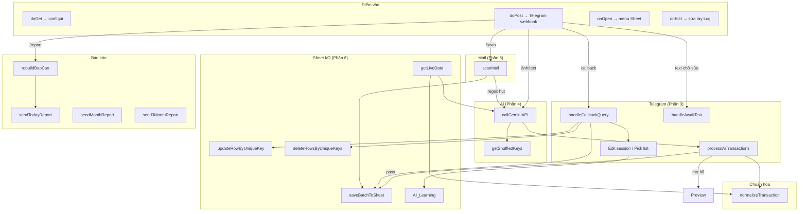

# Cấu trúc `Code.gs` — Sổ Thu Chi AI v2

> Mục đích: bản đồ nhanh để tìm hàm, hiểu luồng, và biết chỗ nào nên tối ưu.  
> File nguồn: `Code.gs` (~1950 dòng). Cập nhật khi tách/gộp hàm lớn.

---

## 1. Sơ đồ tổng quan



---

## 2. Bản đồ phần theo dòng

| Phần | Dòng (ước lượng) | Vai trò |
|------|------------------|---------|
| **1. Thiết lập & tọa độ** | đầu file | Hằng số, config UI, webhook, menu |
| **2. Camera sửa tay Sheet** | `onEdit` | Tự chỉnh dấu ± số tiền theo Thu/Chi |
| **3. Telegram preview/ghi/sửa** | `doPost`… | Webhook, draft, callback, edit flow |
| **Chuẩn hóa GD + helpers TG** | normalize / format / cache | Normalize, format message, cache JSON |
| **4. Gemini & xoay API key** | `callGeminiAPI` | Gọi AI, retry key |
| **5. Quét mail batch** | `scanMail` + hybrid AI | Gmail + regex + Gemini fallback |
| **6. Ghi Sheet & data** | `saveBatchToSheet`… | CRUD Log, AI_Learning, live dict |
| **7. Tiện ích** | Telegram utils | send/edit/delete, money, ảnh, voice |
| **Báo cáo** | `rebuildBaoCao` / `send*Report` | Tính `Bao Cao v2` → Telegram |

---

## 3. Index hàm theo nhóm

### 3.1 Phần 1 — Config & bootstrap

| Hàm | Việc làm |
|-----|----------|
| `doGet` | Serve `configui.html` |
| `maskApiKey` | Che key trước khi trả UI |
| `getConfigToUI` / `saveConfigFromUI` | Đọc/ghi Script Properties |
| `getSoNgayQuet*` / `buildGmailDateFilter` | Bộ lọc ngày quét Gmail |
| `normalizeDateInput` / `parseOwnerNamesInput` | Parse input form |
| `showConfigDialog` | Dialog trong Spreadsheet |
| `setWebhook` | Gắn webhook Telegram = URL Web App |
| `onOpen` | Menu: Cấu hình / Quét mail / Báo cáo |

**Hằng số quan trọng**

- `LOG_COL` — index cột vùng tên `Log` (0-based)
- `DRAFT_TTL` / `UNDO_TTL` (24h) / `EDIT_SESS_TTL` / `OPTS_PAGE_SIZE` / `AI_MAIL_MAX_CALLS`
- `BAO_CAO_SHEET` = `'Bao Cao v2'`
- `AI_LEARNING_SHEET` = `'AI_Learning'`

---

### 3.2 Phần 2 — Sheet trigger

| Hàm | Việc làm |
|-----|----------|
| `onEdit` | Trong vùng `Log`: Chi → số âm, Thu → số dương |

---

### 3.3 Phần 3 — Telegram core

**Entrypoint & pipeline**

| Hàm | Việc làm |
|-----|----------|
| `doPost` | Webhook: lock `update_id` → callback / voice→text / await / lệnh / reply tắt / AI |
| `processAiTransactions` | Normalize từng GD → pass: `commitDraft` ngay; fail: preview + draft |
| `handleCallbackQuery` | Router nút: confirm / undo / edit / pick / page / custom / Điền |
| `handleReplyShortcut` | Reply tin `TX_*`: lệnh tắt `ví MB` / `380k` / `hủy`… |
| `scheduleClearCommittedKeyboard` / `runClearCommittedKeyboard` | Sau 24h gỡ nút Sửa/Hoàn tác trên Telegram |
| `transcribeVoiceGemini` | Voice → chữ (Gemini) |

**Draft & commit**

| Hàm | Việc làm |
|-----|----------|
| `previewKeyboard` / `committedKeyboard` | Inline keyboard |
| `commitDraft` | Ghi sheet + nút hoàn tác |
| `undoCommitted` | Xóa dòng theo unique keys |

**Edit flow (phiên sửa)**

| Hàm | Việc làm |
|-----|----------|
| `startEditFlow` → `showEditMenu` | Mở menu chọn field |
| `beginFieldEdit` → `showPickList` / `beginCustomInput` | Chọn từ sổ hoặc nhập tay |
| `applyPickValue` / `handleAwaitText` | Áp giá trị / nhận text |
| `resolveCustomDictValue` / `handleCustomChoice` | Custom + hỏi thêm sổ tay |
| `confirmEditSessionSave` | Diff → update sheet + `saveAiLearning`; dirty=0 → báo đã lưu (chống double-tap) |
| `openEditSession` / `getEditSession` / `applyToEditSession` | Cache phiên sửa |
| `editSessKey` / `deepCopyTx` | Key cache + copy |
| `getSheetFingerprint` / `readLogRowByUniqueKey` | Đọc lại Log theo UNIQUE_KEY |
| `addToNotebook` | Thêm ví/DM/ĐT vào sheet danh mục |

---

### 3.4 Chuẩn hóa GD + helpers

| Hàm | Việc làm |
|-----|----------|
| `normalizeTransaction` | Ngày, Thu/Chi, tiền, match dict → `partial` + `reasons` |
| `matchDict` / `parseMoneyToken` | Khớp sổ tay / parse số tiền |
| `snapshotTx` / `diffSnapshots` | So sánh trước–sau khi sửa |
| `formatOneTx` / `buildTxMessage` | Tin Telegram emoji gọn (Đã ghi sổ / Xem trước) |
| `parseQuickEdit` | Sửa nhanh / lệnh tắt: `ví MB`, `380k`, `dm …` |
| `extractTxIdFromText` / `escapeHtml` | Lấy `TX_*` từ tin reply |
| `suggestTopOptions` | Gợi ý theo AI_Learning |
| `fieldMapName` | Map field → nhãn |
| `putJsonCache` / `getJsonCache` | CacheService JSON |
| `answerCallback` / `clearInlineKeyboard` | Telegram UX |

**Rule tự ghi:** `normalizeTransaction.pass` → `processAiTransactions` gọi `commitDraft` ngay; giữ Sửa/Hoàn tác 24h.

---

### 3.5 Phần 4 — Gemini

| Hàm | Việc làm |
|-----|----------|
| `getShuffledKeys` | Xáo / xoay danh sách `ai_keys` |
| `callGeminiAPI` | Prompt + liveData + ảnh; thử lần lượt key; parse JSON `giao_dich` |

---

### 3.6 Phần 5 — Quét mail

| Hàm | Việc làm |
|-----|----------|
| `triggerScanMailUI` | Chạy từ menu Sheet + alert |
| `scanMail` | Rule tab `Quet Mail` + Gmail → regex; hụt → `extractMailWithGemini` → batch |
| `extractMailWithGemini` | AI fallback bóc `so_tien` / mã GD / PTTT (max `AI_MAIL_MAX_CALLS`) |

---

### 3.7 Phần 6 — Sheet data

| Hàm | Việc làm |
|-----|----------|
| `saveBatchToSheet` | Append lô vào `Log` (có phục hồi lỗi) |
| `updateRowByUniqueKey` | Sửa 1 dòng theo UNIQUE_KEY |
| `deleteRowsByUniqueKeys` | Xóa (undo) |
| `loadDraftFromSheet` | Khôi phục draft từ sheet nếu mất cache |
| `ensureAiLearningSheet` / `saveAiLearning` / `getAiLessons` | Học từ lần sửa tay |
| `getLiveData` | Ví, user, danh mục, history, lessons |

---

### 3.8 Phần 7 — Utils + Báo cáo

| Hàm | Việc làm |
|-----|----------|
| `returnMsg` / `sendMessage` / `editMessage` / `deleteMessage` | Telegram API |
| `formatMoney` | Format VND |
| `getTelegramFileBase64` / `getTelegramImageBase64` | Tải file/ảnh Telegram → base64 |
| `transcribeVoiceGemini` | Voice → transcript |
| `rebuildBaoCao` / `readBaoCaoV2Block` | Tính & đọc sheet `Bao Cao v2` |
| `sendTodayReport` / `sendMonthReport` / `send3MonthReport` | Đọc `Bao Cao v2` → Telegram |

---

## 4. Luồng chính (để debug / tối ưu)

### A. Nhập GD qua Telegram

```
doPost
  → (voice) getTelegramFileBase64 + transcribeVoiceGemini
  → (ảnh) getTelegramImageBase64
  → getLiveData + callGeminiAPI
  → processAiTransactions
       → normalizeTransaction (từng item)
       → PASS  → commitDraft ngay (+ scheduleClearCommittedKeyboard 24h)
       → FAIL  → Cache DRAFT_* + previewKeyboard
```

### B. Bấm nút / reply Telegram

```
doPost → handleCallbackQuery
  → C:  → commitDraft (preview)
  → X:  → xóa draft (chỉ khi chưa ghi)
  → E:  → startEditFlow → … → confirmEditSessionSave (Điền lưu ngay)
                 → updateRowByUniqueKey + saveAiLearning
  → S:  → confirmEditSessionSave (dirty=0 → báo đã lưu)

doPost → reply tin TX_* → handleReplyShortcut → parseQuickEdit → lưu ngay
```

### C. Quét mail

```
/scan | menu → scanMail
  → buildGmailDateFilter + rules "Quet Mail"
  → blacklist UNIQUE_KEY hiện có
  → regex amount/ref/payment → nếu hụt amount: extractMailWithGemini
  → batchData → saveBatchToSheet
```

### D. Config

```
Menu / Web App → configui
  → getConfigToUI / saveConfigFromUI (Script Properties)
```

### E. Báo cáo

```
Menu 📊 | /report → rebuildBaoCao (Log → Bao Cao v2!A2:E5)
  → sendTodayReport / sendMonthReport / send3MonthReport (1 lần getValues)
```

---

## 5. Cache / Properties / Sheet phụ thuộc

| Key / tài nguyên | Dùng cho |
|------------------|----------|
| Script Properties (`PROP`) | `bot_token`, `admin_id`, `spreadsheet_id`, `ai_keys`, `ai_model`, `ai_prompt`, `owner_names`, `so_ngay_quet`, `quet_tu_ngay`, `quet_den_ngay` |
| Prop `CLR_KB_<triggerUid>` | Gỡ nút Telegram sau 24h |
| Cache `LOCK_<update_id>` | Chống xử lý trùng webhook |
| Cache `DRAFT_<txId>` | Draft chờ confirm / sau ghi (TTL 24h) |
| Cache `UNDO_<txId>` | Keys hoàn tác (24h) |
| Cache `AWAIT_<chatId>` | Chờ user nhập text |
| Cache `EDITSESS_<txId>_<idx>` | Phiên sửa nháp |
| Named range `Log` | Sổ giao dịch chính |
| Sheet `Quet Mail` | Rule keyword mail |
| Sheet `Bao Cao v2` | Số liệu báo cáo (Script) |
| Sheet `AI_Learning` | Lesson từ lần sửa |

**Cột `Log` (`LOG_COL`):**  
`NGAY | PHAN_LOAI | SO_TIEN | VI | DOI_TUONG | DANH_MUC_CHA | DANH_MUC_CON | GHI_CHU | UNIQUE_KEY | STATUS`

---

## 6. Gợi ý chỗ hay tối ưu (map nhanh)

| Ưu tiên | Vùng | Lý do |
|--------|------|--------|
| Cao | `callGeminiAPI` + `getLiveData` | Quota, prompt size, latency |
| Cao | `saveBatchToSheet` / đọc toàn `Log` | I/O Sheet đắt |
| Trung bình | `handleCallbackQuery` + edit flow | Nhiều nhánh, dễ tách file |
| Trung bình | `scanMail` | Gmail search × nhiều rule |
| Thấp | Utils Telegram / format | Ổn định, ít đổi |

---

## 7. Cách dùng file này

1. Cần sửa hành vi bot → bắt đầu từ **§3.3** (`doPost` / `handleCallbackQuery`).  
2. Sai parse AI → **§3.4** `normalizeTransaction` + **§3.5** `callGeminiAPI`.  
3. Sai dấu tiền trên sheet → **§3.2** `onEdit`.  
4. Mail trùng / thiếu → **§3.6** `scanMail` + `LOG_COL.UNIQUE_KEY`.  
5. Khi tách module: giữ nguyên tên hàm public (`doPost`, `doGet`, `onEdit`, `onOpen`) — Apps Script entrypoints.
